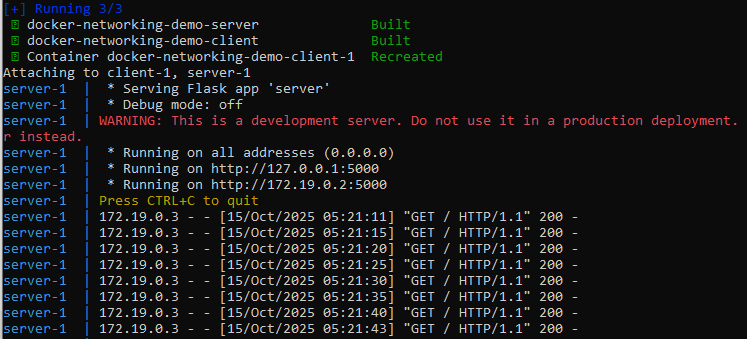

# Docker Networking Demo

## Description
This project demonstrates Docker networking using two services:
- **Server**: A Flask app that handles requests and prints messages.
- **Client**: A python script that handles requests to the server.
The services communicate over a docker network using docker compose.

## Tools
- Python
- Flask
- Linux
- Docker
- Docker Compose

## How to Run
```bash
#Build and Start all containers
docker compose build
docker compose up
```

.The server runs on port 5000 inside docker network
.The client sends requests to the server every few seconds.
.Can include aggregator to print collected logs every 10 seconds.

## Output
1. server prints each request it recieves.
2. client prints responses from the server.
3. aggregator can prints the logs from the both services in realtime.

# Screenshot



