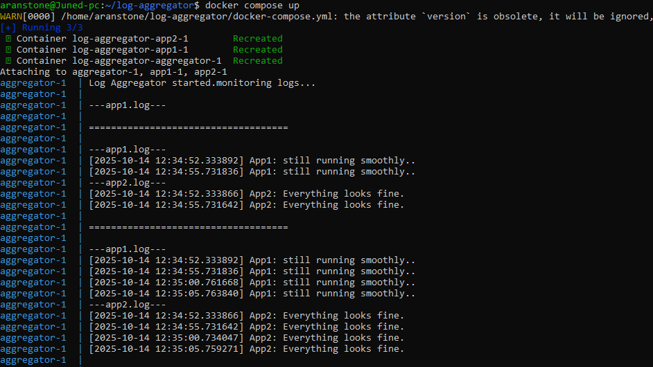

# Log Aggregator

## Description
This project collects logs from two different sources (App1 and App2) and aggregates them in real time.
It uses Docker Compose to run the three services (App1, App2, Aggregator) with a shared volume.

## Tools
- Python
- Docker
- Docker Compose
- Linux

## How to Run
```bash
# Build and start all containers
docker compose build
docker compose up
```
##Output

- The aggregator prints the latest logs from App1 and App2 every 10 seconds, 
  while each app writes its own logs every 5 seconds.

##**ScreenShot**
- 



