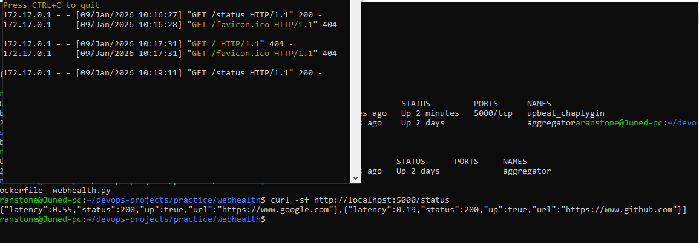
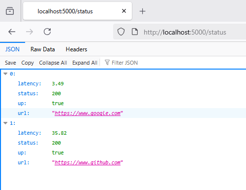

# Website Health Check API

📘 Description

This project demonstrates a lightweight Website Health Monitoring API built with Python and Flask,
containerized using Docker and automated with a scoped GitHub Actions CI pipeline.

It simulates a real-world scenario where a service periodically checks the availability and response
latency of external websites and exposes the results through a REST API endpoint.


🧰 Tools & Technologies

- Python 3 — for building the API service
- Flask — lightweight web framework for REST endpoints
- Requests — for performing HTTP health checks
- Docker — for containerizing the application 
- GitHub Actions — for CI automation (build, test, cleanup)
- Linux (Ubuntu) — development and CI environment

```bash

⚙️ Architecture Overview

practice/webhealth/
│
├── app.py
├── Dockerfile
├── README.md
├── output/
│ ├── output-local.PNG
│ └── output-remote.PNG
└── .github/workflows/
└── webhealth-ci.yml
```

The API checks a predefined list of websites.

For each URL, it:
- sends an HTTP request
- measures response latency
- determines availability status
- returns structured JSON output


🚀 How to Run Locally

### Run without Docker
```bash
pip install flask requests
python app.py

```
Access the API:
```bash
http://localhost:5000/status
```

Run with Docker:

```bash
docker build -t website-health-api .
docker run -p 5000:5000 website-health-api

```

API output Preview:

```bash
[
  {
    "url": "https://www.google.com",
    "status": 200,
    "latency": 0.21,
    "up": true
  }
]

```

📸 Screenshots

Local curl Output:

API response tested locally usingcurl:




Browser Output:

API response accessed via browser at localhost:5000/status:



🤖 CI/CD Automation (GitHub Actions)

This project uses a scoped CI pipeline with GitHub Actions.

Workflow file: .github/workflows/webhealth-ci.yml

```bash

Pipeline Stages

Trigger: Runs only when files inside practice/webhealth/ change

Checkout: Fetches repository code

Validate: Performs Python syntax checks

Build: Builds Docker image

Run: Starts container and waits for service readiness

Test: Validates API endpoint using curl

Cleanup: Stops and removes containers to keep runner clean

```

🧩 Output Summary

✅ External websites are checked for availability
✅ Latency is measured and returned in JSON format
✅ API runs consistently via Docker
✅ CI pipeline validates build and endpoint automatically
✅ Containers are properly cleaned up after CI execution

💡 Future Enhancements

- Make target URLs configurable via environment variables

- Add scheduled health checks and historical logging

- Integrate alerting (Slack / Telegram) on failures

- Extend CI to include automated unit tests

👤 Author

Javed Khan
DevOps / Cloud Engineering Learner

GitHub: https://github.com/JavedKhanIO

LinkedIn: https://www.linkedin.com/in/javedkhanio

Live Resume: https://javedkhanio.github.io/resume/
