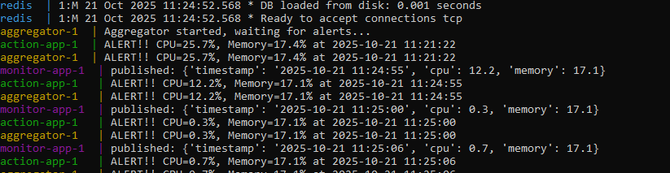
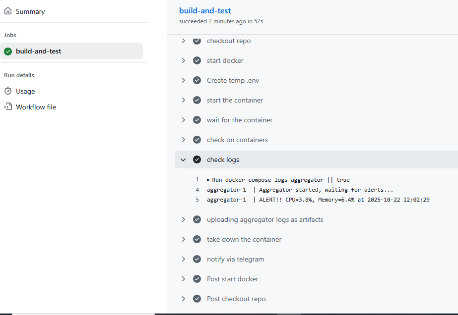
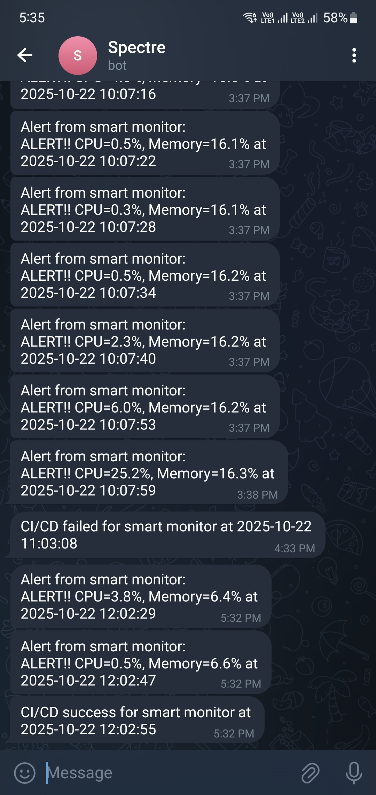

# 🧠 Smart Monitor – Infrastructure as Code Based Alerting System with CI/CD & Telegram Integration

[](https://github.com/JavedKhanIO/automation-lab/actions)
[](https://www.docker.com/)
[](https://www.terraform.io/)
[](https://github.com/features/actions)

---

## 🔍 Overview

Smart Monitor is a modular, containerized monitoring and alert aggregation system built using:

- **Redis Pub/Sub for decoupled communication**
- **Docker for containerization**
- **Terraform (Infrastructure as Code) for container orchestration**
- **GitHub Actions for CI validation**
- **Telegram Bot API for real-time alert delivery**

The project demonstrates practical DevOps lifecycle concepts including:

- Infrastructure definition
- Container networking
- Secret management
- CI validation
- Runtime alerting
- Environment consistency debugging

---

## ⚙️ Architecture

### Core Components

- **monitor-app**
  Monitors system metrics and publishes events to Redis.

- **action-app**  
  Subscribes to alerts, evaluates thresholds, and triggers Telegram notifications.

- **aggregator**  
  Logs alerts using RotatingFileHandler.

- **redis**  
  Pub/Sub message broker.

---

### Architecture Flow

```
monitor-app → Redis (alerts channel) → action-app → Telegram
                                      ↓
                                   aggregator → log storage
```

---

## 🏗 Infrastructure as Code (Terraform)

The project migrated from docker-compose orchestration to **Terraform-managed infrastructure** using the Docker provider.

### Terraform Responsibilities

- Creates custom Docker network
- Builds Docker images
- Creates containers
- Injects environment variables securely
- Manages container lifecycle declaratively

### Terraform Structure

```
smart-monitor/
└── terraform/
    ├── main.tf
    ├── variables.tf
    └── terraform.tfvars (ignored)
```

- `main.tf` → Infrastructure resources (network, containers, images)
- `variables.tf` → Input variable definitions
- `terraform.tfvars` → Local secret values (gitignored)

Secrets are never committed to GitHub.

---

## 🚀 Local Deployment (Terraform-Based)

### 1️⃣ Clone Repository

```
git clone https://github.com/JavedKhanIO/automation-lab.git
cd automation-lab/smart-monitor/terraform
```

### 2️⃣ Create terraform.tfvars

```
bot_token = "your_telegram_bot_token"
chat_id   = "your_chat_id"
```

### 3️⃣ Deploy Infrastructure

```
terraform init
terraform apply
```

Terraform will:

- Create Docker network
- Deploy Redis
- Deploy monitor-app
- Deploy action-app
- Deploy aggregator

### 4️⃣ Destroy Infrastructure

```
terraform destroy
```

---

## 🐳 Development Mode (Docker Compose)

For quick testing without Terraform:

```
docker compose up --build -d
```

---

## ⚡ CI/CD (GitHub Actions)

On every push to `main`:

- Docker images are built
- Terraform configuration is validated
- Terraform plan is executed
- Containers are tested using docker-compose
- Logs are uploaded as artifacts
- Telegram notification is sent for job status

### Required GitHub Secrets

Go to:

GitHub → Settings → Secrets and variables → Actions

Add:

- `TELEGRAM_BOT_TOKEN`
- `TELEGRAM_CHAT_ID`

---

## 🧪 Validation

✔ Redis Pub/Sub working  
✔ Threshold-based alerting  
✔ Telegram API integration  
✔ Terraform network & container management  
✔ CI validation of infrastructure  
✔ Secret injection consistency  

---

## 📸 Screenshots

### Local Run


### CI/CD Execution


### Telegram Alert


---

## 📁 Project Structure

```
smart-monitor/
│
├── app/
│   ├── monitor-app/
│   ├── action-app/
│   └── aggregator/
│
├── logs/
├── docker-compose.yml
├── terraform/
│   ├── main.tf
│   ├── variables.tf
│   └── terraform.tfvars (ignored)
│
└── .github/workflows/
```

---

## 🧩 Technologies Used

- Python 3
- Redis (Pub/Sub messaging)
- Docker
- Terraform (Docker Provider)
- GitHub Actions
- Telegram Bot API
- RotatingFileHandler (structured logging)

---

## 🧠 Key DevOps Concepts Demonstrated

- Infrastructure as Code (Terraform)
- Custom Docker networking
- Secret management via environment variables
- Container lifecycle management
- CI validation of infrastructure
- Debugging environment drift between local and CI
- Pub/Sub microservice architecture
- Observability via structured logs

---

## 🚀 Future Enhancements

- Add Prometheus + Grafana monitoring stack
- Deploy to AWS using Terraform AWS provider
- Push Docker images to registry
- Implement multi-environment infrastructure
- Add health checks & container restart policies

---

## 👨‍💻 Author

Javed Khan  
DevOps | Infrastructure as Code | CI/CD | Cloud Automation

