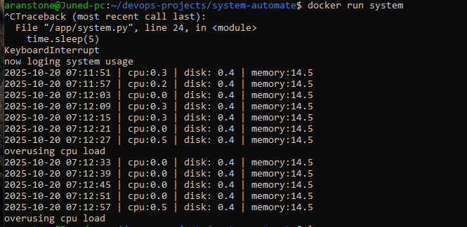

#System Monitor – Dockerized + CI/CD

🚀 Mini Project demonstrating system monitoring in Python with automated CI/CD deployment using GitHub Actions

🧩 Overview

This project monitors system metrics (CPU, memory, disk usage) using Python (psutil) 
and logs them continuously. It demonstrates:

- Containerizing a Python application with Docker

- Automating build, run, and test processes using GitHub Actions CI/CD

- Creating a reliable pipeline to deploy and monitor small-scale services
```
🧱 Architecture
automation-lab/
├── system-automate/
│   └── monitor.py      # Python script for CPU, memory, disk monitoring
├── Dockerfile           # Docker image definition
└── .github/workflows/
    └── system-ci-cd.yml # CI/CD pipeline
```

- Logs are stored in log.txt inside the container

- Monitors run continuously every 5 seconds

- Triggers a warning message if CPU usage exceeds threshold (30%)

⚙️ Tech Stack

- Python 3 + psutil

- Docker

- GitHub Actions for CI/CD automation

- Ubuntu GitHub Runner

🖥️ Usage
Run Locally
# Build Docker image
docker build -t system-monitor ./system-automate

# Run Docker container
docker run -d --name sysmon system-monitor

# View logs
docker logs sysmon

# Stop and remove container
docker stop sysmon && docker rm sysmon

#ScreenShot of locally run result



🔄 CI/CD Workflow

Triggered on push or pull request to main branch

Steps:

1. Checkout repository

2. Build Docker image

3. Run container

4. Verify logs / basic health checks

5. Tear down container

#ScreenShot of GitActions:


✅ Demonstrates end-to-end automated deployment and testing in a containerized environment.

🧠 Key Learnings

- Dockerizing Python scripts for continuous monitoring

- Automating build & deployment pipelines with GitHub Actions

- Understanding container lifecycle and logging

- Building simple system observability tools

🧾 Future Enhancements

Add multi-service monitoring (CPU, memory, disk, network)

Aggregate metrics in Redis and trigger notifications

Advanced CI/CD: build multiple services, aggregate logs, trigger alerts

🧑‍💻 Author

Javed Khan – DevOps | Cloud | Automation

GitHub: [www.github.com/JavedKhanIO]

LinkedIn: [https://in.linkedin.com/in/javedkhanio]
